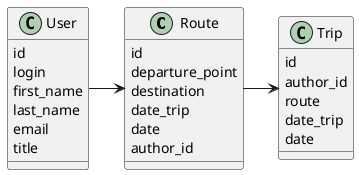

# Компонентная архитектура
<!-- Состав и взаимосвязи компонентов системы между собой и внешними системами с указанием протоколов, ключевые технологии, используемые для реализации компонентов.
Диаграмма контейнеров C4 и текстовое описание. 
-->
## Компонентная диаграмма

```plantuml
@startuml name
!include https://raw.githubusercontent.com/plantuml-stdlib/C4-PlantUML/master/C4_Container.puml

AddElementTag("microService", $shape=EightSidedShape(), $bgColor="CornflowerBlue", $fontColor="white", $legendText="microservice")
AddElementTag("storage", $shape=RoundedBoxShape(), $bgColor="lightSkyBlue", $fontColor="white")

Person(admin, "Администратор")
Person(moderator, "Модератор")
Person(user, "Пользователь")

System_Ext(web_site, "Клиентский веб-сайт", "HTML, CSS, JavaScript, React", "Веб-интерфейс")

System_Boundary(conference_site, "Сервис поиска попутчиков") {
   'Container(web_site, "Клиентский веб-сайт", ")
   Container(client_service, "Сервис авторизации", "C++", "Сервис управления пользователями", $tags = "microService")    
   Container(route_service, "Сервис маршрутов", "C++", "Сервис управления маршрутами", $tags = "microService") 
   Container(trip_service, "Сервис поездок", "C++", "Сервис управления поездками", $tags = "microService")   
   ContainerDb(db, "База данных", "MySQL", "Хранение данных о маршрутах, поездках и пользователях", $tags = "storage")
   
}

Rel(admin, web_site, "Просмотр, добавление и редактирование информации о пользователях, маршрутах и поездках")
Rel(moderator, web_site, "Модерация контента и пользователей,подключение пользователей к поездкам")
Rel(user, web_site, "Регистрация, создание, просмотр, получение информации о маршрутах и поездках")

Rel(web_site, client_service, "Работа с пользователями", "localhost/person")
Rel(client_service, db, "INSERT/SELECT/UPDATE", "SQL")

Rel(web_site, route_service, "Работа с маршрутами", "localhost/pres")
Rel(route_service, db, "INSERT/SELECT/UPDATE", "SQL")

Rel(web_site, trip_service, "Работа с поедками", "localhost/conf")
Rel(trip_service, db, "INSERT/SELECT/UPDATE", "SQL")

@enduml
```
## Список компонентов  

### Сервис авторизации
**API**:
-	Создание нового пользователя
      - входные параметры: login, пароль, имя, фамилия, email, обращение (г-н/г-жа)
      - выходные параметры: отсутствуют
-	Поиск пользователя по логину
     - входные параметры:  login
     - выходные параметры: имя, фамилия, email, обращение (г-н/г-жа)
-	Поиск пользователя по маске имени и фамилии
     - входные параметры: маска фамилии, маска имени
     - выходные параметры: login, имя, фамилия, email, обращение (г-н/г-жа)

### Сервис маршрутов
**API**:
- Создание маршрута
  - Входные параметры: пункт отправления, пункт назначения, дата поездки, автор и дата создания
  - Выходыне параметры: идентификатор маршрута
- Получение списка всех маршрутов
  - Входные параметры: индентицикатор маршрута
  - Выходные параметры: массив всех маршрутов, где для каждого указаны его идентификатор, маршрут, дата поездки,автор и дата написания

### Сервис поездок
**API**:
- Создание поездки
  - Входные параметры: маршрут, дата поездки, автор, дата создания
  - Выходные параметры: идентификатор поездки
- Получение списка поездок
  - Входные параметры: идентификатор поездки
  - Выходные параметры: массив с поездками (идентификатор поездки, маршрут, дата поездки, автор, дата создания)
- Получение информации о поездке
  - Входнае параметры: идентификатор поездки
  - Выходные парамтеры: идентификатор поездки, дата поездки, маршрут, автор, дата создания
- Внесение изменения в поездку
  - Входные параметры: идентификатор поездки
  - Выходные парамтеры: отсутствуют
  
### Модель данных 


